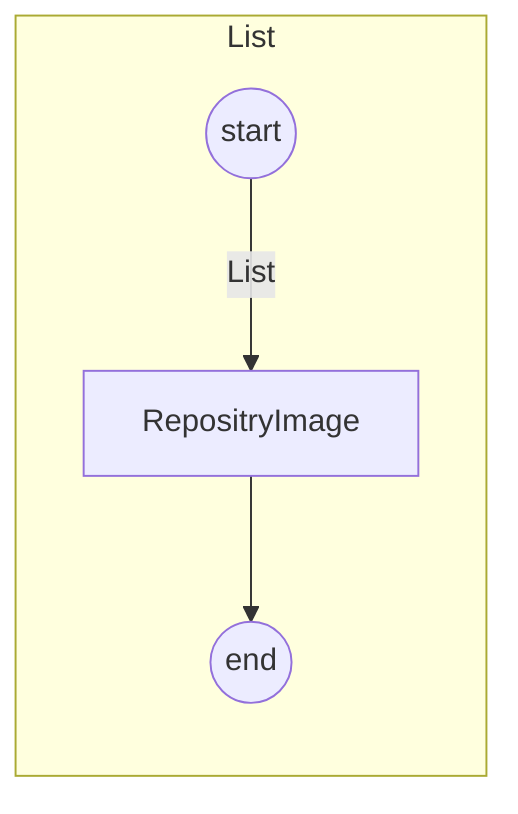
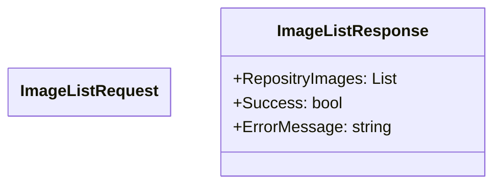

# Application.Service.Image

```mermaid
    graph TB    
        subgraph List
            direction TB
            start1((start))
            Image1[RepositryImage]
            termination1((end))

            %%{relationship}%%
            start1 --"List"--> Image1 --> termination1
        end
```

---

```mermaid
---
config:
    class:
        hideEmptyMembersBox: true
---
    classDiagram
        class ImageListRequest {
        }

        class ImageListResponse{
            +RepositryImages: List<RepositryImage>
            +Success: bool
            +ErrorMessage: string
        }
```
