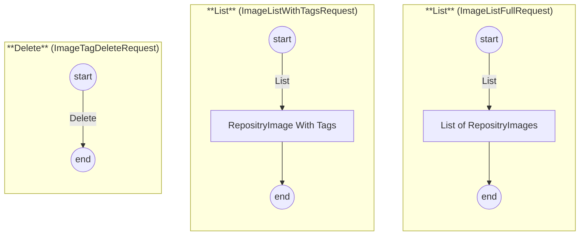
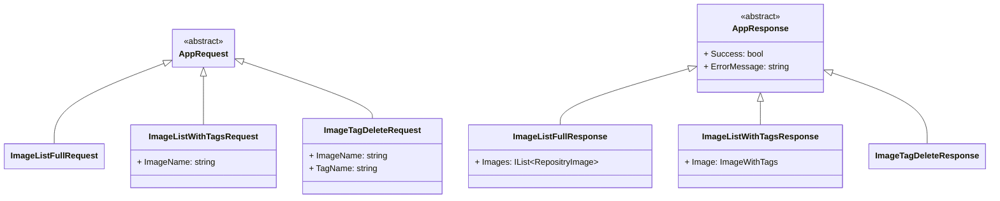

# Application.Services.Image.ImageAppService

```mermaid
    graph TB    
        subgraph List["**List** (ImageListFullRequest)"]
            direction TB
            start1((start))
            Image1[List of RepositryImages]
            termination1((end))

            %%{relationship}%%
            start1 --"List"--> Image1 --> termination1
        end

        subgraph List2["**List** (ImageListWithTagsRequest)"]
            direction TB
            start2((start))
            Image2[RepositryImage With Tags]
            termination2((end))

            %%{relationship}%%
            start2 --"List"--> Image2 --> termination2
        end

        subgraph List3["**Delete** (ImageTagDeleteRequest)"]
            direction TB
            start3((start))
            termination3((end))

            %%{relationship}%%
            start3 --"Delete"--> termination3
        end

```

---

```mermaid
---
config:
    class:
        hideEmptyMembersBox: true
---
    classDiagram

        class AppRequest {
            <<abstract>>
        }

        class AppResponse {
            <<abstract>>
            + Success: bool
            + ErrorMessage: string
        }
    
        class ImageListFullRequest {
        }

        class ImageListWithTagsRequest {
            + ImageName: string
        }

        class ImageTagDeleteRequest{
            + ImageName: string
            + TagName: string
        }

        class ImageListFullResponse{
            + Images: IList~RepositryImage~
        }

        class ImageListWithTagsResponse{
            + Image: ImageWithTags
        }

        class ImageTagDeleteResponse{
        }


        %%{relationship}%%
        AppRequest <|-- ImageListFullRequest
        AppResponse <|--ImageListFullResponse
        AppRequest <|-- ImageListWithTagsRequest
        AppResponse <|--ImageListWithTagsResponse
        AppRequest <|-- ImageTagDeleteRequest
        AppResponse <|--ImageTagDeleteResponse

```
