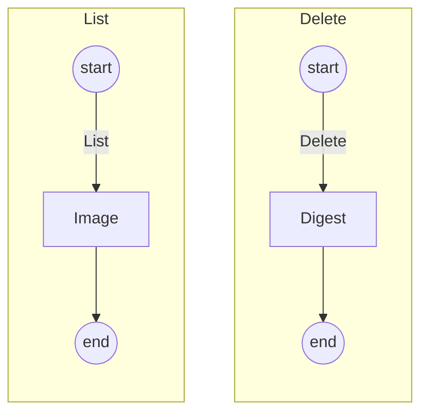
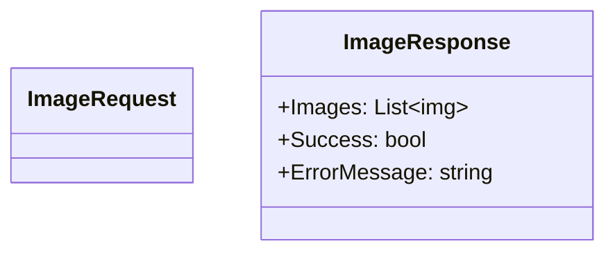

# Application.Service.Image

```mermaid
    graph TB
        subgraph Delete
            direction TB
            start2((start))
            digest2[Digest]
            termination2((end))

            %%{relationship}%%
            start2 --"Delete"--> digest2 --> termination2
        end
        
        subgraph List
            direction TB
            start1((start))
            Image1[Image]
            termination1((end))

            %%{relationship}%%
            start1 --"List"--> Image1 --> termination1
        end
```

```mermaid
    classDiagram
        class ImageRequest {
        }

        class ImageResponse{
            +Images: List<Image>
            +Success: bool
            +ErrorMessage: string
        }

```