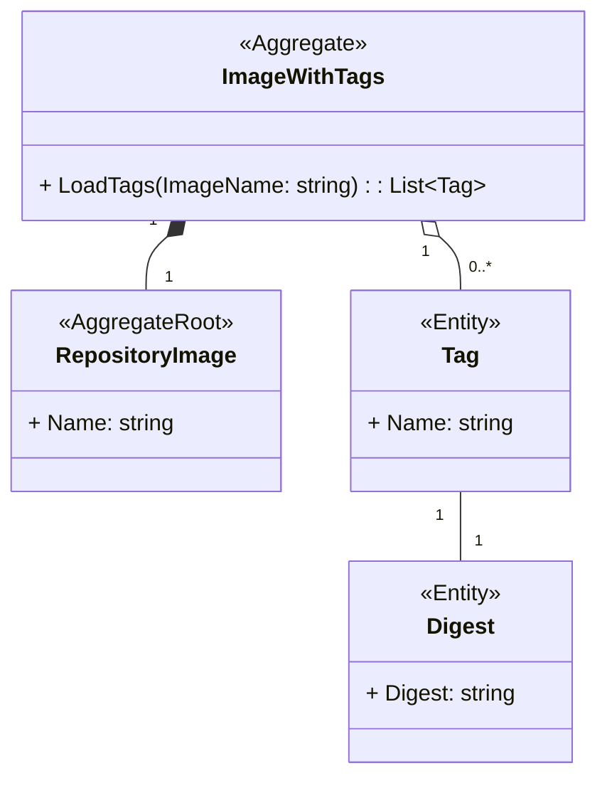

# Domain

```mermaid
---
config:
    class:
        hideEmptyMembersBox: true
---

classDiagram
    class RepositoryImage {
        <<AggregateRoot>>
        + Name: string
    }

    class Tag {
        <<Entity>>
        + Name: string
    }

    class Digest {
        <<Entity>> 
        + Digest: string
    }

    class ImageWithTags {
        <<Aggregate>>
        + LoadTags(ImageName: string): List~Tag~
    }

    %%{{relationship}}%%
    ImageWithTags "1"*--"1" RepositoryImage
    ImageWithTags "1"o--"0..*" Tag
    Tag "1" --"1" Digest
```
